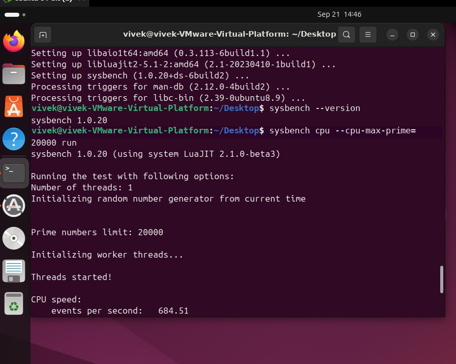
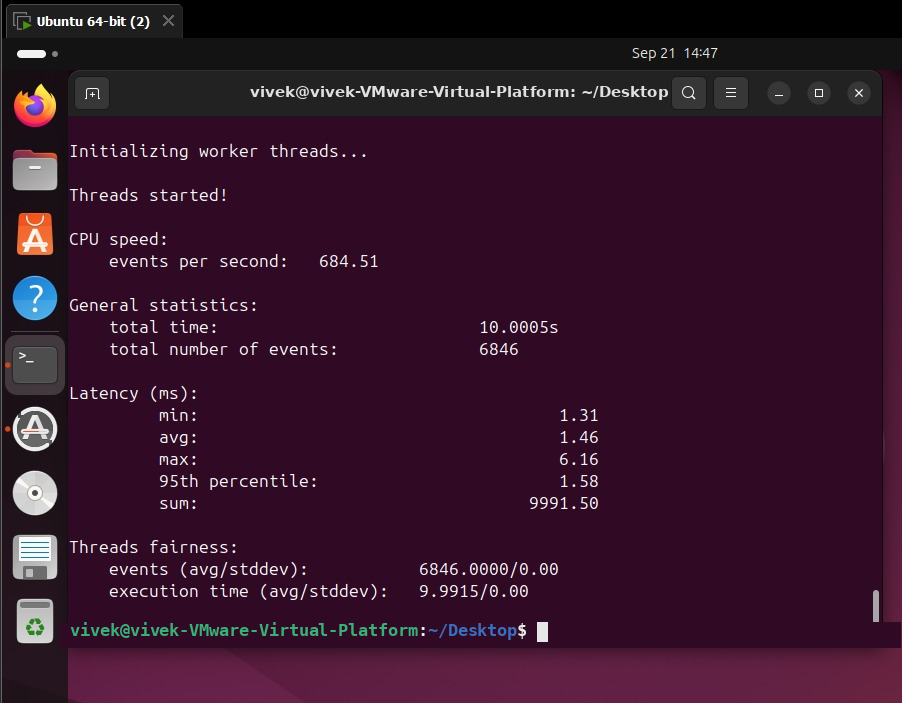
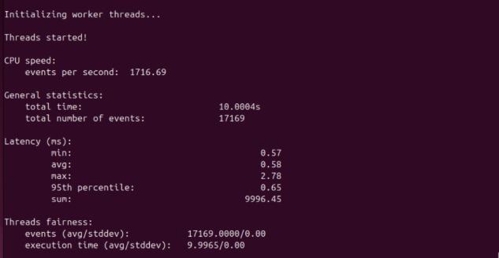
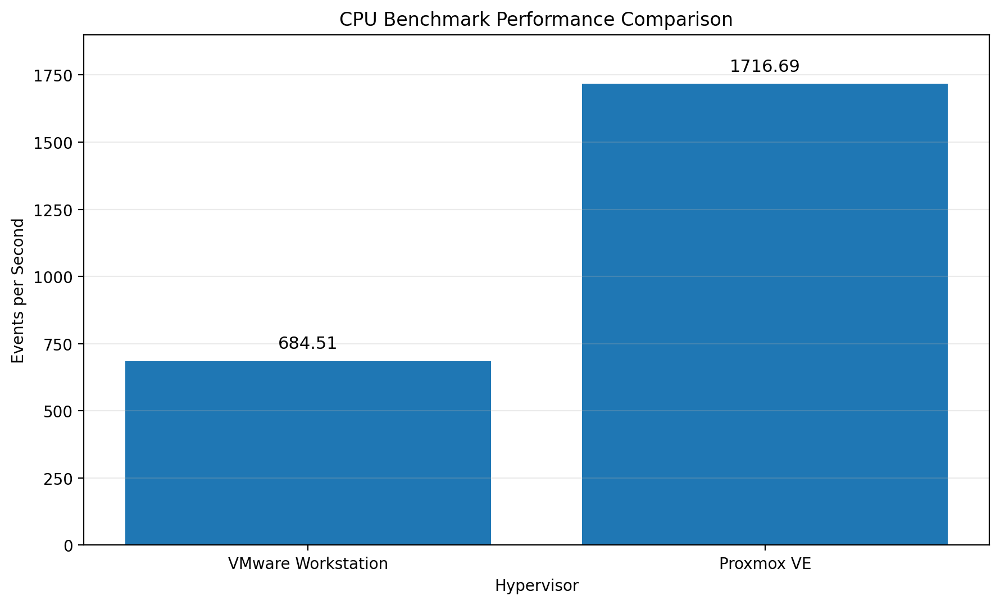

# Experiment 1: Performance Comparison of Type-1 and Type-2 Hypervisors

## 1. Aim

To compare the CPU performance of a **Type-1 hypervisor** and a **Type-2 hypervisor** by running the same virtual machine CPU benchmark under similar conditions.

The hypervisors used in this experiment are:

* **Proxmox VE** – Type-1 Hypervisor
* **VMware Workstation** – Type-2 Hypervisor

The CPU performance is measured using the **Sysbench CPU benchmark**.

---

## 2. Objectives

1. To understand virtualization and hypervisors.
2. To study the difference between Type-1 and Type-2 hypervisors.
3. To configure a virtual machine using Proxmox VE.
4. To configure a virtual machine using VMware Workstation.
5. To execute the same CPU benchmark in both environments.
6. To collect CPU performance metrics.
7. To compare the performance of both hypervisors.
8. To analyze the effect of virtualization architecture on CPU performance.

---

## 3. Software and Hardware Requirements

### Software Requirements

| Component              | Used               |
| ---------------------- | ------------------ |
| Type-1 Hypervisor      | Proxmox VE         |
| Type-2 Hypervisor      | VMware Workstation |
| Guest Operating System | Linux              |
| Benchmark Tool         | Sysbench           |
| Benchmark              | Sysbench CPU       |
| Prime Number Limit     | 20,000             |
| Threads                | 1                  |

### Hardware Requirements

A physical computer capable of supporting hardware virtualization and running virtual machines is required.

The virtual machine configuration and benchmark settings were kept as similar as possible for both environments.

---

# 4. Theory

## 4.1 Virtualization

Virtualization is a technology that allows multiple virtual machines to run on a single physical computer.

A **hypervisor** manages virtual machines and provides them with virtualized resources such as:

* CPU
* Memory
* Storage
* Network

Hypervisors are mainly classified into two types:

1. Type-1 Hypervisor
2. Type-2 Hypervisor

---

## 4.2 Type-1 Hypervisor

A Type-1 hypervisor runs directly on the physical hardware.

It does not require a conventional host operating system between the physical hardware and the hypervisor.

### Example Used

**Proxmox VE**

### Architecture

```text
+-----------------------------+
|      Physical Hardware      |
+-----------------------------+
              |
              v
+-----------------------------+
|        Proxmox VE           |
|     Type-1 Hypervisor       |
+-----------------------------+
              |
              v
+-----------------------------+
|       Linux Virtual VM      |
+-----------------------------+
              |
              v
+-----------------------------+
|    Sysbench CPU Benchmark   |
+-----------------------------+
```

---

## 4.3 Type-2 Hypervisor

A Type-2 hypervisor runs as software on top of a host operating system.

### Example Used

**VMware Workstation**

### Architecture

```text
+-----------------------------+
|      Physical Hardware      |
+-----------------------------+
              |
              v
+-----------------------------+
|     Host Operating System   |
+-----------------------------+
              |
              v
+-----------------------------+
|      VMware Workstation     |
|     Type-2 Hypervisor       |
+-----------------------------+
              |
              v
+-----------------------------+
|       Linux Virtual VM      |
+-----------------------------+
              |
              v
+-----------------------------+
|    Sysbench CPU Benchmark   |
+-----------------------------+
```

---

# 5. Experimental Architecture

The experiment compares CPU performance by executing the same Sysbench CPU benchmark inside virtual machines running on two different hypervisor architectures.

```text
                         Physical Hardware
                                |
                  +-------------+-------------+
                  |                           |
                  v                           v
            Proxmox VE                 Host Operating System
            Type-1 Hypervisor                  |
                  |                            v
                  |                   VMware Workstation
                  |                   Type-2 Hypervisor
                  |                            |
                  v                            v
             Linux VM                      Linux VM
                  |                            |
                  +-------------+--------------+
                                |
                                v
                     Sysbench CPU Benchmark
                                |
                                v
                     Performance Measurements
                                |
                                v
                         Result Comparison
```

---

# 6. Benchmark Tool – Sysbench

**Sysbench** is a benchmarking tool used to measure system performance.

It can be used for different types of workloads such as:

* CPU
* Memory
* File I/O
* Database performance

For this experiment, the **CPU benchmark** is used.

### Benchmark Command

```bash
sysbench cpu --cpu-max-prime=20000 run
```

The benchmark performs CPU calculations involving prime numbers up to the specified limit.

The primary metric considered for comparison is:

**Events per second**

A higher value indicates higher CPU benchmark throughput.

---

# 7. Benchmark Configuration

| Parameter               | Value             |
| ----------------------- | ----------------- |
| Benchmark               | Sysbench CPU      |
| Prime Number Limit      | 20,000            |
| Number of Threads       | 1                 |
| Main Performance Metric | Events per second |

The same benchmark command and configuration were used for both environments.

---

# 8. Experimental Procedure

## Step 1: Configure the Virtual Machines

Create and configure a Linux virtual machine for each hypervisor.

* Configure one Linux VM using **Proxmox VE**.
* Configure another Linux VM using **VMware Workstation**.
* Keep the VM resources and benchmark configuration as similar as possible.

---

## Step 2: Start the Virtual Machine

Start the Linux virtual machine and open the terminal.

Verify that the guest operating system is running correctly.

---

## Step 3: Install Sysbench

Install Sysbench inside the Linux virtual machine.

For Ubuntu/Debian-based systems:

```bash
sudo apt update
sudo apt install sysbench
```

---

## Step 4: Verify Sysbench

Check the installed version:

```bash
sysbench --version
```

---

## Step 5: Run the CPU Benchmark

Execute the following command:

```bash
sysbench cpu --cpu-max-prime=20000 run
```

The same command is executed in both virtual machines.

---

## Step 6: Record the Results

Record the Sysbench output after the benchmark completes.

The raw benchmark results are stored in:

```text
results/
├── proxmox/
│   └── sysbench_cpu.txt
└── vmware/
    └── sysbench_cpu.txt
```

---

## Step 7: Capture Screenshots

Screenshots of the benchmark execution are stored in:

```text
images/
├── proxmox/
│   └── proxmox_output.jpeg
└── vmware/
    ├── 1.png
    └── 2.png
```

---

# 9. VMware Workstation Experiment

## 9.1 Environment

VMware Workstation is used as the **Type-2 hypervisor**.

The Linux virtual machine runs on VMware Workstation, which itself runs on the host operating system.

### Architecture

```text
Physical Hardware
       |
       v
Host Operating System
       |
       v
VMware Workstation
       |
       v
Linux Virtual Machine
       |
       v
Sysbench CPU Benchmark
```

---

## 9.2 Benchmark Command

```bash
sysbench cpu --cpu-max-prime=20000 run
```

---

## 9.3 VMware Results

| Metric                  | VMware Workstation |
| ----------------------- | -----------------: |
| Events per second       |             684.51 |
| Total execution time    |          10.0005 s |
| Total events            |              6,846 |
| Minimum latency         |            1.31 ms |
| Average latency         |            1.46 ms |
| Maximum latency         |            6.16 ms |
| 95th percentile latency |            1.58 ms |
| Sum latency             |         9991.50 ms |

---

## 9.4 VMware Screenshots

### VMware Benchmark Output



### VMware Additional Output



---

# 10. Proxmox VE Experiment

## 10.1 Environment

Proxmox VE is used as the **Type-1 hypervisor**.

The Linux virtual machine runs directly under the Proxmox virtualization platform.

### Architecture

```text
Physical Hardware
       |
       v
Proxmox VE
Type-1 Hypervisor
       |
       v
Linux Virtual Machine
       |
       v
Sysbench CPU Benchmark
```

---

## 10.2 Benchmark Command

```bash
sysbench cpu --cpu-max-prime=20000 run
```

---

## 10.3 Proxmox Results

| Metric                  | Proxmox VE |
| ----------------------- | ---------: |
| Events per second       |    1716.69 |
| Total execution time    |  10.0004 s |
| Total events            |     17,169 |
| Minimum latency         |    0.57 ms |
| Average latency         |    0.58 ms |
| Maximum latency         |    2.78 ms |
| 95th percentile latency |    0.65 ms |
| Sum latency             | 9996.45 ms |

---

## 10.4 Proxmox Screenshot

### Proxmox Benchmark Output



---

# 11. Results Comparison

The CPU benchmark results obtained from both hypervisors are compared below.

| Metric                  | VMware Workstation | Proxmox VE |
| ----------------------- | -----------------: | ---------: |
| Events per second       |             684.51 |    1716.69 |
| Total execution time    |          10.0005 s |  10.0004 s |
| Total events            |              6,846 |     17,169 |
| Minimum latency         |            1.31 ms |    0.57 ms |
| Average latency         |            1.46 ms |    0.58 ms |
| Maximum latency         |            6.16 ms |    2.78 ms |
| 95th percentile latency |            1.58 ms |    0.65 ms |
| Sum latency             |         9991.50 ms | 9996.45 ms |

---

# 12. Performance Graph

The following graph compares the CPU benchmark throughput of VMware Workstation and Proxmox VE.


---

# 13. Latency Comparison

The average latency recorded during the experiment was:

| Hypervisor         | Average Latency |
| ------------------ | --------------: |
| VMware Workstation |         1.46 ms |
| Proxmox VE         |         0.58 ms |

Proxmox VE recorded a lower average latency in this experiment.

### Other latency measurements

| Latency Metric  | VMware Workstation | Proxmox VE |
| --------------- | -----------------: | ---------: |
| Minimum         |            1.31 ms |    0.57 ms |
| Average         |            1.46 ms |    0.58 ms |
| Maximum         |            6.16 ms |    2.78 ms |
| 95th percentile |            1.58 ms |    0.65 ms |

---

# 14. Result Analysis

The experimental results show that:

* VMware Workstation achieved **684.51 events/sec**.
* Proxmox VE achieved **1716.69 events/sec**.
* Proxmox VE achieved approximately **2.51 times higher CPU benchmark throughput**.
* The average latency was **1.46 ms** for VMware Workstation.
* The average latency was **0.58 ms** for Proxmox VE.
* Both benchmarks completed in approximately **10 seconds**.

Under the tested configuration, Proxmox VE provided better CPU benchmark performance than VMware Workstation.

The result demonstrates that the virtualization architecture and the additional software layer in a Type-2 environment can influence virtual machine performance.

However, the result is specific to the hardware, VM configuration, host load, and benchmark conditions used in this experiment. It should not be treated as a universal performance comparison between Proxmox VE and VMware Workstation.

---

# 15. Experimental Evidence

The repository contains screenshots and raw benchmark outputs for verification.

### Proxmox


### VMware


---

# 16. Raw Benchmark Results

The complete Sysbench outputs are preserved in the repository.

### Proxmox

```text
results/proxmox/sysbench_cpu.txt
```

### VMware

```text
results/vmware/sysbench_cpu.txt
```

These files contain the original benchmark output used to prepare the result tables.

---

# 17. Advantages

* The same CPU benchmark is used for both hypervisors.
* The same prime-number limit is used.
* The same number of threads is used.
* Raw benchmark output is preserved.
* Multiple performance metrics are recorded.
* Screenshots provide experimental evidence.
* The experiment demonstrates the practical difference between Type-1 and Type-2 virtualization.

---

# 18. Limitations

* Performance depends on the underlying physical hardware.
* VM resource allocation can affect benchmark results.
* Host operating system load can affect Type-2 hypervisor performance.
* A CPU benchmark does not represent every aspect of virtualization performance.
* A single benchmark configuration cannot represent all possible workloads.
* Repeated benchmark runs would provide stronger statistical confidence.

---

# 19. Repository Structure

```text
Cloud-Computing/
│
├── README.md
├── LAB_REPORT.md
│
├── images/
│   │
│   ├── proxmox/
│   │   └── proxmox_output.jpeg
│   │
│   └── vmware/
│       ├── 1.png
│       └── 2.png
│
└── results/
    │
    ├── proxmox/
    │   └── sysbench_cpu.txt
    │
    └── vmware/
        └── sysbench_cpu.txt
```

---

# 20. Conclusion

This experiment compared the CPU performance of a **Type-1 hypervisor, Proxmox VE**, and a **Type-2 hypervisor, VMware Workstation**, using the Sysbench CPU benchmark.

The same benchmark configuration was used in both environments with a prime-number limit of **20,000** and **1 thread**.

The measured results were:

* **VMware Workstation:** 684.51 events/sec
* **Proxmox VE:** 1716.69 events/sec

Proxmox VE achieved approximately **2.51 times higher CPU benchmark throughput** than VMware Workstation under the tested conditions.

The experiment demonstrates how hypervisor architecture and virtualization overhead can affect virtual machine CPU performance.

---

## 21. References

1. Proxmox VE Documentation
2. VMware Workstation Documentation
3. Sysbench Documentation
4. Linux Virtualization Documentation
